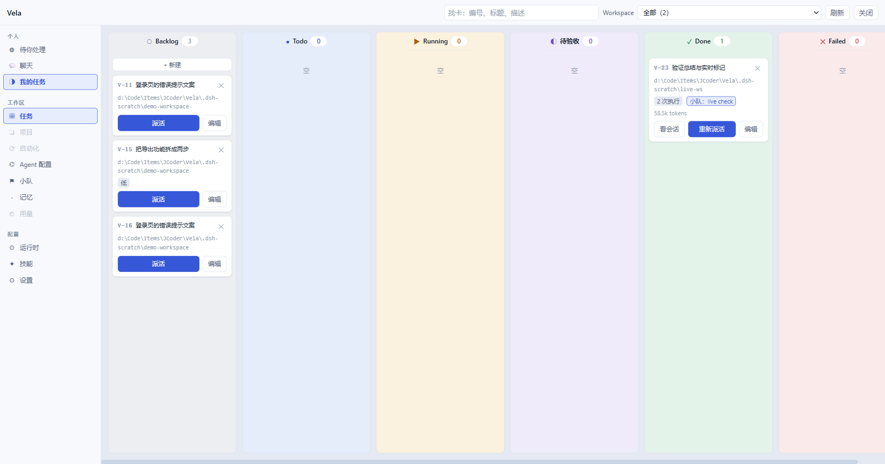
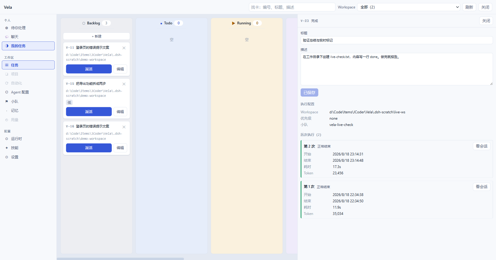
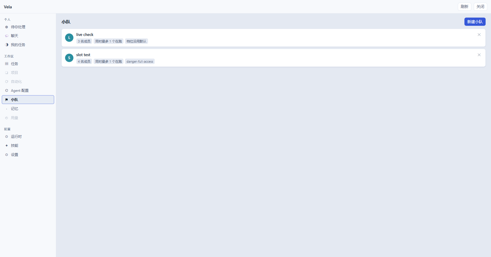
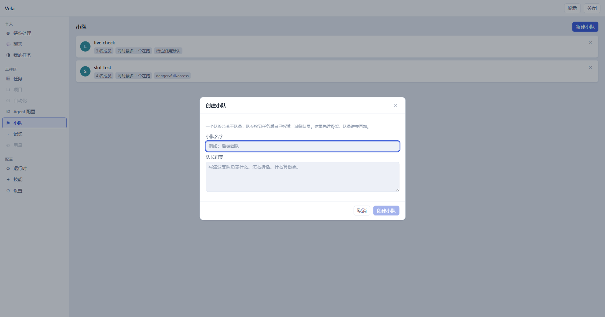
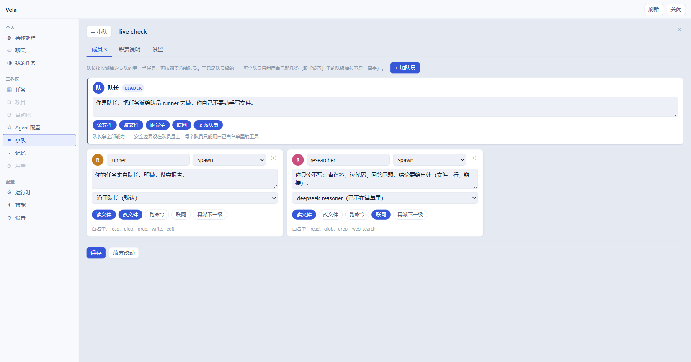
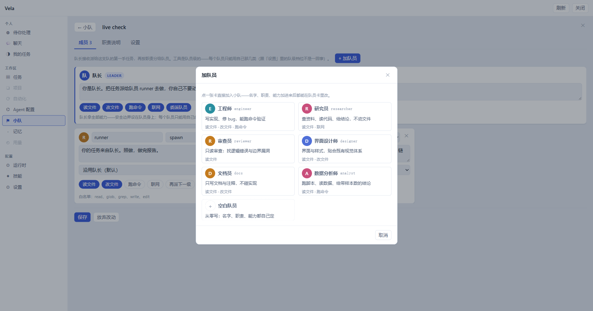
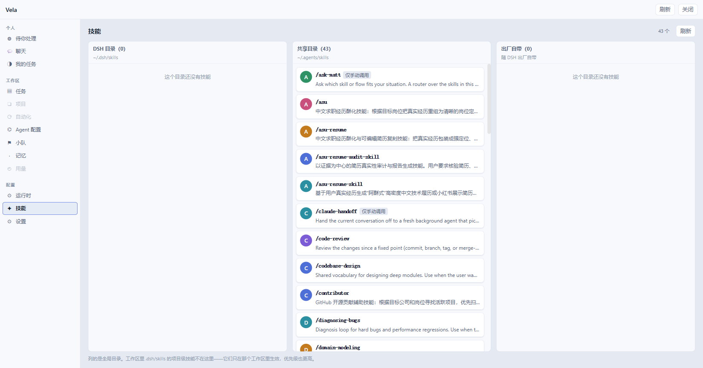

# Vela

**Vela** 发音 `/ˈvɛlə/`，拉丁语意为「帆」，也是南天星座 **船帆座** 的名字。

帆本身不产生动力，它只是顺应风力——看似无为，却能让整艘船乘风破浪、高速前行。这正是 Vela 的隐喻：**AI 是你的风，Vela 是你的帆**。它不替你做决定，只是让 AI 驱动的任务井井有条，帮你一个人像一支队伍一样运转。

——

Vela 是给 [DeepSeek Harness](https://github.com/deepseek-ai/deepseek-harness) 用的看板插件。把所有要交给 AI 干的活摆上六列看板：点一下「派活」，AI 就真的去你的项目里干活；干完了由你验收——**AI 有权交付，无权宣布通过**。



## 安装

推荐直接从 GitHub 安装到 DSH 的 `web` profile：

```sh
dsh plugin --profile web add github:Goe99/Vela
# 如果 dsh web 正在运行，重启后刷新页面
```

装好后，点 DSH 网页版侧边栏底部的「▦ Vela」就能打开看板。构建产物已经随仓库提交，不需要额外构建。想确认装上了，运行 `dsh --profile web --dump-config`，能看到 `vela` 行就是成了。需要改源码的话，克隆仓库后在仓库目录运行 `dsh plugin --profile web add .`。

看板在网页界面里展示，所以要装到带网页界面的组合里——DSH 自带的 `web` profile 就满足。

### 配置

一般不用动，默认就够用。想改的话，在 profile 的 `cordis.patch.yml` 里覆盖 `vela` 行：

| 项 | 含义 | 默认 |
|---|---|---|
| `boardPath` | 看板数据存到哪个文件 | `$DSH_HOME/vela/board.json` |
| `memoryPath` | AI 的复盘笔记存到哪个目录；**把这行删掉就整个关掉记忆功能**：AI 不再写复盘，派活时也不再引用过去的经验 | `$DSH_HOME/vela/memory` |
| `exec.agentPreset` | 派活时默认用哪个 Agent 配置 | 沿用 DSH 自己的默认 |
| `exec.sandbox` | 派活时默认用哪个权限配置 | 沿用创建会话时定下的默认 |
| `exec.timeoutMs` | 派活的超时毫秒数，0 或不填 = 不限时 | 不限时 |

就算 DSH 组合里没有执行能力，看板、建卡、排序、验收也都照常用，只是卡片上不会出现「派活」按钮。

## 它是怎么转起来的

一张卡片就是一件活，看板的六列各是一个阶段：

**Backlog → Todo → Running → 待验收 → Done**（干砸了的进 **Failed**）

点卡片上的「派活」，AI 在一个独立会话里真的开始执行，卡片自己滑到 Running；干完滑到「待验收」等你检查——你点「接受」它才进 Done，不满意就退回 Todo。卡片永远按这个规则走，没有捷径。

## 界面一览

**卡片抽屉**：点开卡片就能改标题、描述和执行配置；每次执行的耗时和 Token 消耗一条条记在案，还能一键跳回当时干活的会话。



**小队**：把几个 Agent 角色攒成一支可复用的队伍，派活时整队出动。



建队先定队长——写清这支队负责什么、怎么拆活、什么算做完：



队长和队员各自的分工、模型、能力范围都在详情页里调：队长拿全部能力，每个队员只能用自己白名单里的工具——安全边界设在队员身上。



加队员不用从零写：工程师、研究员、审查员……点一张角色模板卡就进队，进来之后还能再改。



**技能广场**：当前装了哪些技能，一眼看全。



## 功能

- **六列看板**：卡片在哪一列，活就干到哪个阶段；不允许跳级——没人验收的卡进不了 Done。拖卡片用鼠标或者 Alt + 方向键都行。
- **一键派活**：点一下，AI 真的在你的项目目录里干活，不是模拟。干活的会话用任务标题命名，在侧边栏一眼认出。
- **验收闸门**：AI 干完只能到「待验收」，永远自己进不了 Done。
- **失败与重试**：失败原因直接写在卡片上。可以让失败的活自动重试——默认关着，想开按卡片单独开。
- **Token 用量**：干活时看实时消耗，结束后记进卡片档案。
- **每张卡单独定规则**：用哪个 Agent、什么权限、多长时间，都可以按卡片覆盖全局默认。
- **多项目一板看全**：所有项目的卡片都在一块板上，也可以按项目筛着看。
- **批量建卡**：粘贴一段多行文本，一行变一张卡。

## 技术要点

- **不添依赖**：前端没有引入任何新的第三方库，拖拽用的是浏览器原生能力。
- **不怕 DSH 升级**：Vela 只用 DSH 官方对外的协作方式，不碰它的内部实现，DSH 版本更新不容易把 Vela 带坏。
- **数据在你手里**：看板数据就是一个 JSON 文件，路径你说了算，随时打开看、备份、搬走。

想深入实现细节的，设计决策记录在 [`docs/adr/`](./docs/adr)，术语表在 [`CONTEXT.md`](./CONTEXT.md)。

## 开发

```sh
pnpm install
pnpm typecheck   # 类型检查
pnpm test        # 单元测试
pnpm build       # 产出 lib/index.mjs + lib/index.js
pnpm verify      # typecheck + test
```

`lib/` 随仓库提交（GitHub 安装路径没有构建步骤）：改动源码后请重新 `pnpm build` 并把产物一并提交。
